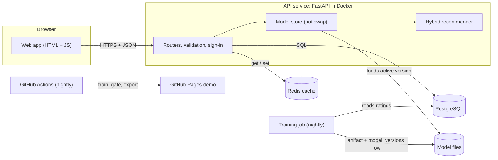

# Where next? A travel recommender for India

[](https://github.com/shivamsinghsr/travel-recommender/actions/workflows/ci.yml)
[](https://github.com/shivamsinghsr/travel-recommender/actions/workflows/pages.yml)

Personalised recommendations for 66 Indian destinations. New travellers get picks from the interests they
choose; as they rate places, a collaborative-filtering model gets a growing share of the say. A nightly job
retrains the model, tests it on trips it has never seen, and only publishes it if it is at least as good as
the one already live.

**Live demo:** https://shivamsinghsr.github.io/travel-recommender/
(the demo runs the recommender in your browser; the full stack below adds accounts and a shared database)

## Results

Each simulated traveller's most recent 20% of trips are hidden. Configurations are tuned on a separate
validation split, then every model is scored once on the hidden trips. A hit is a recommended place the
traveller later rated 4 or 5.

| Model | Precision@5 | Recall@5 | NDCG@5 | Catalogue coverage |
|---|---|---|---|---|
| Most popular | 0.057 | 0.193 | 0.126 | 45% |
| User-based CF (the original prototype's idea, bugs fixed) | 0.041 | 0.135 | 0.087 | 83% |
| Phase 2 hybrid (untuned blend) | 0.058 | 0.199 | 0.128 | 44% |
| Matrix factorisation alone | 0.056 | 0.186 | 0.115 | 64% |
| Content-based alone | 0.111 | 0.379 | 0.265 | 100% |
| **Tuned hybrid (published)** | **0.114** | **0.389** | **0.275** | **98%** |

The tuned hybrid is 3.2× better than the original approach on NDCG@5 and beats each of its parts.
The biggest lesson: collaborative filtering predicts *how much* someone will like a place, but *whether they
go* depends mostly on what kind of place it is. Letting held-out data choose the blend (here 30% CF at most)
more than doubled quality over the hand-picked Phase 2 blend.

## Architecture



- **Web app** (`web/`): plain HTML, CSS and ES modules, no build step. In *demo* mode it loads `model.json`
  and runs the recommender in the browser; served by the API it switches to *API* mode with real accounts.
- **API** (`api/`): FastAPI with SQLAlchemy 2, Alembic migrations, PBKDF2 password hashing, JWT access tokens,
  per-user authorisation, sign-in throttling and a Redis cache invalidated per user.
- **Recommender** (`recsys/`): pure Python + NumPy, no web or database code, fully unit-tested.
- **Training** (`recsys/train.py`, `api/train.py`): tune on validation, report on test, gate against the live
  model, write a versioned artifact, activate it in `model_versions`. Running APIs swap it in without a restart.

## How recommendations work

```
alpha = alpha_max × min(number of ratings, 5) / 5
score = alpha × CF + (1 − alpha) × (c × content + (1 − c) × popularity)
```

| Part | What it does |
|---|---|
| Content-based (`recsys/content.py`) | Each destination is a vector of type, region and season. Your profile comes from the interests you pick and the places you rate. Works with zero ratings. |
| Matrix factorisation (`recsys/mf.py`) | Biased ALS: `rating ≈ μ + b_user + b_place + p_user · q_place`. At request time your vector is *folded in* from your current ratings, so a new rating counts immediately. |
| Item-based CF (`recsys/item_knn.py`) | "People who liked X also liked Y". A candidate the training job can pick instead of MF. |
| Popularity (`recsys/popularity.py`) | Bayesian-average rating, so two 5-star reviews don't beat two hundred 4.6s. |
| Filters | Type, state and month are applied *before* scoring. Places you have rated never come back. |
| Explanations | "Because you rated Kaziranga 5/5" (the rated place closest in latent space) or "Matches your interest in Wildlife destinations". |

`alpha_max`, `c` and the CF model are chosen by grid search on validation data. The same algorithm runs in
Python and JavaScript; `tests/test_parity.py` runs both on 84 cases per CF engine and fails if any ranking,
score or explanation differs.

## Run it

**Full stack with Docker** (PostgreSQL, Redis, API, web app, nightly retraining):

```bash
docker compose up --build
```

Open http://localhost:8000 and sign in as any sample traveller, e.g. `traveller1@example.com` with password
`travel-demo`, or create your own profile. API docs are at http://localhost:8000/docs.

**Without Docker** (SQLite and an in-process cache):

```bash
python -m venv .venv && source .venv/bin/activate
pip install -r requirements-dev.txt
DEMO_PASSWORD=travel-demo python -m api.seed   # migrate + load data/*.csv
python -m api.train                            # train and activate a model (about 20 s)
uvicorn api.main:app --reload                  # http://127.0.0.1:8000
```

**Static demo only:** `python -m recsys.train --export-web web/model`, then serve `web/` with any static server.

**Tests:** `pytest` (SQLite). Set `TEST_DATABASE_URL` and `TEST_REDIS_URL` to run against real PostgreSQL and
Redis, as CI does.

## API

All `/api/users/{id}/…` routes need `Authorization: Bearer <token>` for that same user.

| Method | Path | Purpose |
|---|---|---|
| POST | `/api/auth/register` | Create an account, returns a token |
| POST | `/api/auth/login` | Sign in, returns a token (10 failures per email per 15 min, then 429) |
| GET | `/api/me` | The signed-in user |
| GET | `/api/destinations?type=&state=&month=` | Browse the catalogue (public) |
| PATCH | `/api/users/{id}` | Update name or interests |
| GET, POST | `/api/users/{id}/ratings` | List ratings / add or update one |
| DELETE | `/api/users/{id}/ratings/{destination_id}` | Remove a rating |
| GET | `/api/users/{id}/recommendations?k=&type=&state=&month=` | Picks with scores and reasons; `X-Cache` and `X-Model-Version` headers |
| GET | `/api/model` | Active model version, configuration and test metrics |
| GET | `/api/health` | Database, cache and model status |

## Configuration

| Variable | Default | Notes |
|---|---|---|
| `DATABASE_URL` | `sqlite:///./travel.db` | Any SQLAlchemy URL; `postgres://` is accepted too |
| `REDIS_URL` | unset | In-process cache when unset |
| `SECRET_KEY` | development value | **Required** (32+ chars) when `ENVIRONMENT=production` |
| `ENVIRONMENT` | `development` | `production` refuses to start with the development secret |
| `DEMO_PASSWORD` | unset | Lets the 800 sample travellers sign in |
| `CORS_ORIGINS` | `*` | Comma-separated browser origins |
| `MODELS_DIR` | `./models` | Versioned model artifacts |
| `MODEL_CHECK_SECONDS` | `900` | How often the API looks for a newly activated model |

See `.env.example`. To deploy the full stack, run the Docker image on any container host with managed
PostgreSQL and Redis, set the variables above, and run the image with `scheduler` (or a cron calling `train`)
for nightly retraining.

## Project layout

```
recsys/        recommender core: data, content, item_knn, mf, hybrid, metrics, train, simulate
api/           FastAPI app, models, auth, cache, model store, seed and training jobs
migrations/    Alembic schema versions
web/           static web app (demo + API modes)
data/          destinations (real) and simulated users/ratings
tests/         44 tests: unit, API, PostgreSQL/Redis, training gate, browser parity
docker/        container entrypoint (api | train | scheduler)
```

## How it was built

The commit history follows three phases, each leaving a working app:

1. **Fix and expose.** The original prototype indexed users with `user_id - 1`, crashed for large IDs,
   recommended places twice and served only HTML. Phase 1 fixed the ID mapping and added a JSON API and tests.
2. **Make it learn.** PostgreSQL, migrations, ratings write-back, content-based scoring for new users,
   item-based CF, filters before scoring, and the web app.
3. **Make it production-grade.** Matrix factorisation, offline evaluation with a time-based split, tuning,
   a publish gate, versioned models with hot swap, Redis, sign-in, CI with PostgreSQL/Redis/Docker,
   and nightly retraining.

## Limitations

- Ratings are **simulated**. Simulated travellers state preferences that track their hidden tastes closely,
  which flatters content-based scoring; real data would need the evaluation re-run.
- Model artifacts live on a shared volume. Several API hosts would need shared storage (S3 or similar).
- Sign-in throttling is per process; behind several workers or hosts it should move to Redis.

## License

MIT
